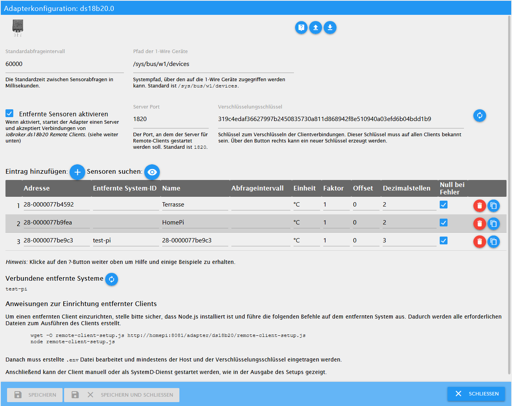

# ioBroker.ds18b20

Der Adapter `ds18b20` ermöglicht die direkte Einbindung von 1-Wire Temperatursensoren des Typs DS18B20 in ioBroker.

Es wird eine entsprechende Hardware mit Unterstützung für den 1-Wire Bus benötigt (z.B. Raspberry Pi) und der 1-Wire Bus muss auf dem System funktionsfähig eingerichtet sein (Sensoren unter `/sys/bus/w1/devices/` aufgelistet).

## Features

* Auslesen des aktuellen Temperaturwertes
* Automatische Erkennung der angeschlossenen Sensoren
* Fehlererkennung beim Abfragen der Sensoren (Checksumme, Kommunikationsfehler, Gerät getrennt)
* Abfrageintervall pro Sensor anpassbar
* Rundung und Umrechnung des gemessenen Wertes pro Sensor anpassbar

## Installation

Der Adapter kann er über die URL `https://github.com/crycode-de/ioBroker.ds18b20.git` installiert werden.

## Konfiguration

In der Adapterkonfiguration kann der **Standardabfrageintervall** für alle Sensoren in Millisekunden festgelegt werden. Das Minimum ist 500.

In einer Tabelle können die einzelnen Sensoren händisch oder über *Sensoren suchen* hinzugefügt werden.

Die **Adresse** ist dabei die 1-Wire Adresse/ID des Sensors und bestimmt zugleich das die Objekt-ID.
Ein Sensor mit der Adresse `28-0000077ba131` bekommt beispielsweise die Objekt-ID `ds18b20.0.sensors.28-0000077ba131`.

Der **Name** ist zur Identifizierung des Sensors frei wählbar.

Es kann für jeden Sensor ein extra **Abfrageintervall** in Millisekunden festgelegt werden.
Wird das Feld leer gelassen, so gilt der Standardabfrageintervall.
Das Minimum ist 500.

Die **Einheit** bestimmt die im ioBroker-Objekt hinterlegte Einheit zu dem Wert.
Standardmäßig ist dies `°C`.

Über **Faktor** und **Offset** ist es möglich den vom Sensor gelesenen Wert nach der Formel `Wert = (Wert * Faktor) + Offset` anzupassen.

Die **Dezimalstellen** geben an, auf wie viele Stellen nach dem Komma der Wert gerundet wird.
Die Rundung erfolgt nach der Berechnung mit Faktor und Offset.

**Null bei Fehler** legt fest, wie mit Fehlern beim Lesen des Sensors verfahren werden soll.
Ist die Option gesetzt, dann werden `null`-Werte bei Fehlern in den State des Sensors geschrieben.
Ohne diese Option wird bei Fehlern der State nicht aktualisiert.

### Umrechnung von `°C` in `°F`
Damit die gemessenen Temperaturen vom Adapter in `°F` zurückgegeben werden, müssen als Faktor `1.8` und als Offset `32` verwendet werden.

## Adapter-Informationen

Über den `ds18b20.*.info.connection` State stellt jede Adapterinstanz eine Information bereit, ob alle konfigurierten Sensoren Daten liefern.
Wenn das jeweils letzte Lesen von allen Sensoren erfolgreich war, ist dieser State `true`.
Sobald einer der Sensoren einen Fehler aufweist, ist dieser State `false`.
