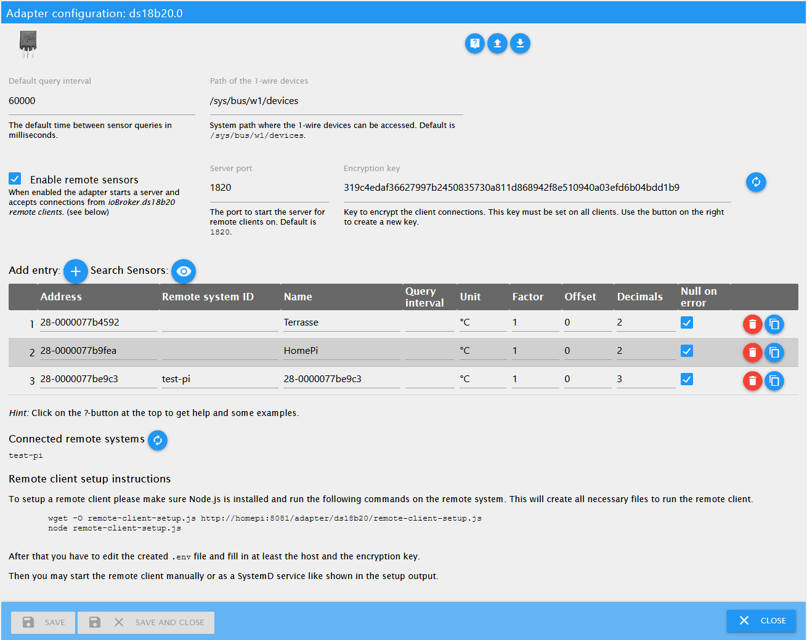

# ioBroker.ds18b20

The adapter `ds18b20` enables the direct integration of 1-wire temperature sensors of the type DS18B20 into ioBroker.

An appropriate hardware with support for the 1-wire bus is required (e.g. Raspberry Pi). Also the 1-wire bus must be properly functional on the system (sensors listed in `/sys/bus/w1/devices/`).

## Features

* Read the current temperature value
* Auto detect of the connected sensors
* Detection of errors while reading a sensor (checksum, communication error, device disconnected)
* Query interval customizable per sensor
* Rundung und Umrechnung des gemessenen Wertes pro Sensor anpassbar
* Rounding and conversion of the measured value customizable per sensor

## Installation

The adapter can be installed using the URL `https://github.com/crycode-de/ioBroker.ds18b20.git`.

## Configuration

In the adapter configuration, a **Default query interval** can be specified in milliseconds for all sensors. Minimum is 500.

The sensors can be added to a table manually or by **Search Sensors**.

The **Address** is the 1-wire address/ID of the sensor and determines the object ID.
As an example, a sensor with the address `28-0000077ba131` gets the object ID `ds18b20.0.sensors.28-0000077ba131`.

The **Name** is used to identity the sensor. It's freely selectable by you.

For each sensor a custom **Query interval** may be specified in milliseconds.
If this field is left blank, the default query interval will be used.
Minimum is 500.

The **Unit** defines the stored unit in the ioBroker object for the value.
Default is `°C`.

Via **Factor** and **Offset** it is possible to adjust the value read by the sensor according to the formula `value = (value * factor) + offset`.

The **Decimals** indicate how many places after the decimal point the value is rounded.
The rounding takes place after the calculation with factor and offset.

**Null on error** defines how sensor read errors are handled.
If this option is set, a `null` value be written to the sensor state on error.
If unset, the state will not be updated on errors.

### Conversion from `°C` to `°F`
To get the temperatures from the adapter in `°F` you need to use `1.8` as factor and `32` as offset.

## Adapter information
Via the `ds18b20.*.info.connection` State, each adapter instance provides information on whether all configured sensors provide data.
If the last reading of all sensors was successful, this state is `true`.
As soon as one of the sensors has an error, this state is `false`.
